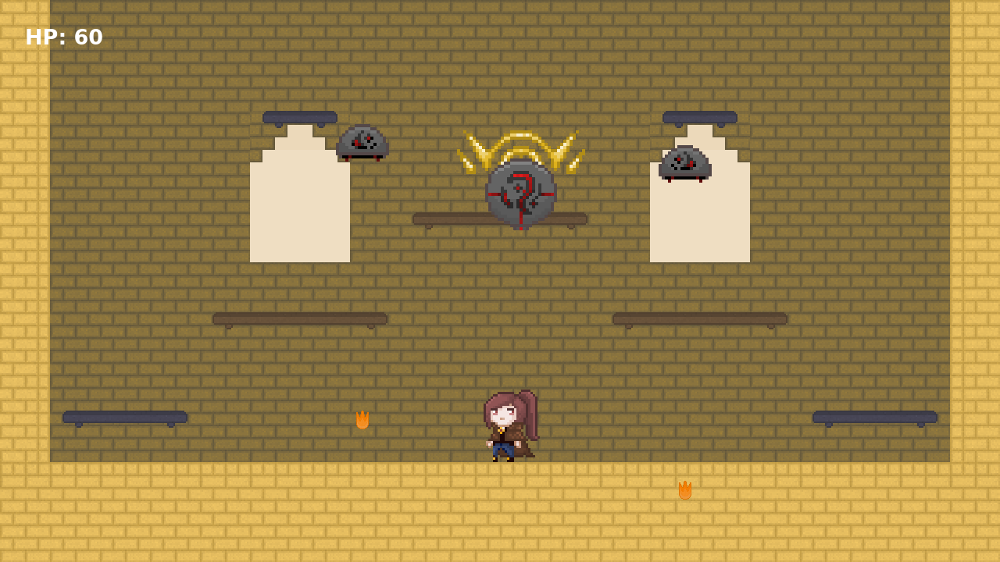
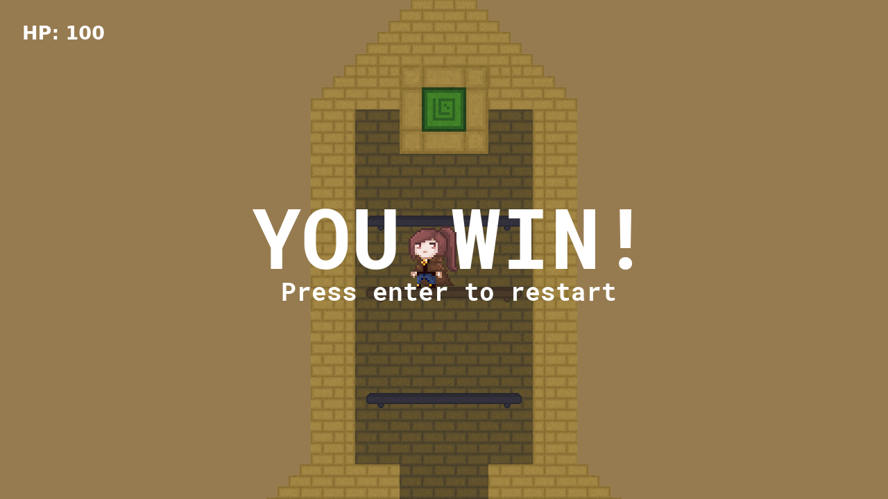
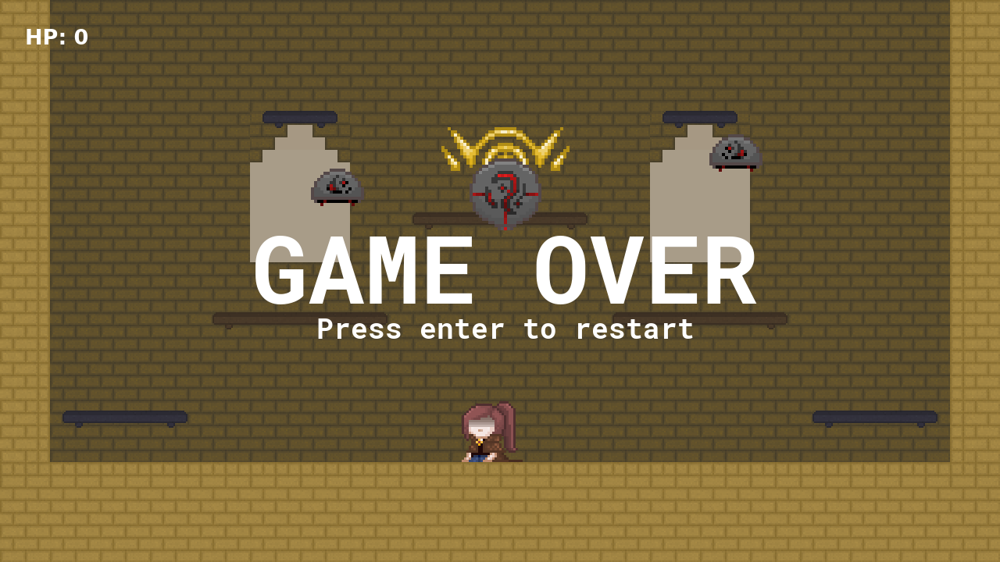

# Ancient Tower (LD36)
This game is our entry for the 36th Ludum Dare jam!

## Story & Goal
The theme of this Ludum Dare was "Ancient Technology", so we came up with the
idea of an enchanted artifact/rune that is terrorising the land around it. The
artifact can only be deactivated by reaching the top of the tower and pressing
(colliding with) the activator. The tower was supposed to resemble the Tower of
Babel in an alternate timeline where the world maintained one universal
language. However, due to time restraints, the story aspect had to be left out
of the gameplay.

## Install & Run
```
$ npm install -g http-server
$ npm install
$ http-server
```

## Creators
- Brendan Goodenough (developer)
- Jean Lee (designer)

## Controls
Keys | Action
--- | ---
A | Move left
D | Move right
S + Spacebar | Fall through platform
Spacebar | Jump

## Screenshots




